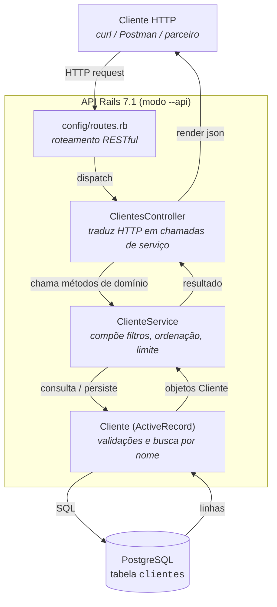

# API de Clientes

API REST em Ruby on Rails 7.1 (modo `--api`) com CRUD do recurso
Cliente, contagem total e busca por nome. Estrutura segue o MVC do
Rails com uma camada de Service entre Controller e Model, espelhando o
desenho do exemplo Java do enunciado.

Os comandos rodados durante a construção do projeto estão em
[`PASSOS.md`](PASSOS.md). Diagramas em Mermaid (contexto C4, componentes,
mapa de endpoints e sequência de `POST /clientes`) em
[`diagrama.md`](diagrama.md). Code review e refactors que entraram
depois dele estão em [`CODE_REVIEW.md`](CODE_REVIEW.md).

## Stack

- Ruby 3.1.6
- Rails 7.1 (modo `--api`)
- Active Record + PostgreSQL
- Puma e Minitest (defaults do Rails)

## Arquitetura

O fluxo de um request é `Routes → Controller → Service → Model → DB`.
O Controller cuida só de HTTP (params, status, JSON). O Service
(`ClienteService`) compõe filtros, ordenação e hard limit, e devolve
booleanos honestos nas escritas. O Model (`Cliente`) tem as validações
e a query de busca por nome com escape de wildcards.



## Estrutura de pastas

Só o que importa pra entender o projeto. O resto é o esqueleto padrão
de `rails new --api`.

```
desafio-final-pos/
├── app/
│   ├── controllers/
│   │   ├── application_controller.rb       # trata 404 via rescue_from
│   │   └── clientes_controller.rb          # index (com ?nome=), show, create, update, destroy, count
│   ├── models/
│   │   └── cliente.rb                      # validações, normalização, busca por nome
│   └── services/
│       └── cliente_service.rb              # composição de filtros, ordenação, hard limit
├── config/
│   ├── application.rb                      # locale pt-BR
│   ├── database.yml                        # conexão PostgreSQL
│   ├── locales/pt-BR.yml                   # mensagens de validação traduzidas
│   └── routes.rb                           # resources :clientes + /count
├── db/
│   ├── migrate/
│   │   ├── 20260524120426_create_clientes.rb
│   │   └── 20260524170000_add_constraints_to_clientes.rb
│   └── schema.rb
├── test/                                   # minitest (model + integração)
├── README.md
├── PASSOS.md
├── CODE_REVIEW.md
└── diagrama.md
```

| Componente | Arquivo | Responsabilidade |
| --- | --- | --- |
| Model | `app/models/cliente.rb` | Mapeia a tabela `clientes`, valida (`presence`, formato de email, unicidade case-insensitive, tamanho) e normaliza email/nome no `before_validation`. Também tem o scope `busca_por_nome`, que escapa wildcards de `ILIKE` (`%`, `_`, `\`). |
| Controller | `app/controllers/clientes_controller.rb` | Recebe a requisição, aplica strong parameters, chama o service e devolve status + JSON. Não fala SQL nem regra de negócio direto. |
| Service | `app/services/cliente_service.rb` | Compõe `listar(filtros)` com filtro + ordenação + hard limit. Escritas retornam boolean; leitura por id usa `find` (404 vira responsabilidade do `ApplicationController`). |
| Routes | `config/routes.rb` | `resources :clientes` + `/count` em `collection`. |
| Migration / Schema | `db/migrate/*`, `db/schema.rb` | Schema versionado: `NOT NULL`, `limit:`, índice único em `lower(email)`. |

A "view" da API é o próprio JSON renderizado pelo controller — em modo
`--api` o Rails não gera views nem assets.

## Endpoints

Base local: `http://localhost:3000`

| Verbo | Rota | Ação | Descrição |
| --- | --- | --- | --- |
| POST | `/clientes` | `create` | Cria um cliente (`{ nome, email }`) |
| GET | `/clientes` | `index` | Lista clientes. `?nome=...` filtra por nome (`ILIKE %nome%`, case-insensitive). Retorna no máximo 100. |
| GET | `/clientes/:id` | `show` | Busca por id |
| PATCH / PUT | `/clientes/:id` | `update` | Atualiza |
| DELETE | `/clientes/:id` | `destroy` | Remove |
| GET | `/clientes/count` | `count` | Total de clientes (sem filtro) |

Erros: 404 retorna `{ "errors": { "base": ["Cliente não encontrado"] } }`,
422 retorna `{ "errors": { "campo": ["mensagem"] } }`.

## Como rodar

```bash
bundle install
bin/rails db:create db:migrate
bin/rails server
```

A API sobe em `http://localhost:3000`.

Testes: `bin/rails test`.

## Exemplos com curl

```bash
# Criar
curl -X POST http://localhost:3000/clientes \
  -H "Content-Type: application/json" \
  -d '{"cliente": {"nome": "Maria Silva", "email": "maria@example.com"}}'

# Listar todos
curl http://localhost:3000/clientes

# Buscar por nome
curl "http://localhost:3000/clientes?nome=maria"

# Buscar por id
curl http://localhost:3000/clientes/1

# Atualizar
curl -X PATCH http://localhost:3000/clientes/1 \
  -H "Content-Type: application/json" \
  -d '{"cliente": {"email": "maria.nova@example.com"}}'

# Excluir
curl -X DELETE http://localhost:3000/clientes/1

# Contar
curl http://localhost:3000/clientes/count
# => {"total": 1}
```

## Notas de produção

O que está intencionalmente fora do escopo do desafio e precisaria ser
endereçado antes de expor essa API em produção:

- Sem autenticação ou autorização. Qualquer cliente HTTP pode listar,
  criar, atualizar e remover. Para uso real, no mínimo um token por
  parceiro validado em middleware.
- `ILIKE '%foo%'` não usa índice btree por causa do wildcard à
  esquerda. O caminho de upgrade é habilitar `pg_trgm` no PostgreSQL e
  criar um índice GIN sobre `nome` (`CREATE INDEX ON clientes USING gin
  (nome gin_trgm_ops);`).
- Listagem tem hard limit de 100 (`ClienteService::MAX_RESULTADOS`).
  Quando isso deixar de servir, trocar por `kaminari`/`pagy` com
  `?page=&per_page=` e total via header `X-Total-Count`.
