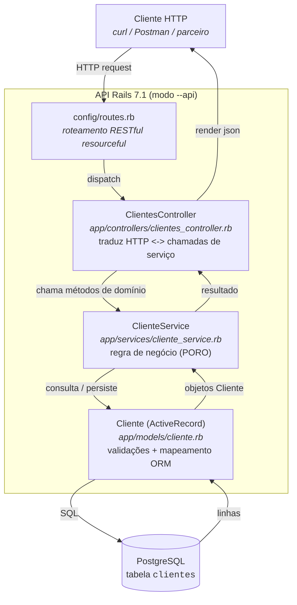

# API de Clientes: Desafio Final (Arquitetura de Software)

API RESTful em **Ruby on Rails 7.1 (modo `--api`)** que expõe um CRUD do
domínio **Cliente**, seguindo o padrão arquitetural **MVC**, com uma
camada explícita de **Service** entre o Controller e o Model.

Atende ao enunciado da disciplina de Arquitetura de Software: construir
e disponibilizar uma API REST para parceiros, com CRUD + endpoints
auxiliares de contagem e busca por nome.

> Os comandos executados na construção do projeto, em ordem cronológica,
> estão registrados em [`PASSOS.md`](PASSOS.md).
> Os diagramas de arquitetura (C4 + sequência) estão em
> [`diagrama.md`](diagrama.md).

---

## Sumário

- [Stack](#stack)
- [Arquitetura](#arquitetura)
- [Estrutura de pastas](#estrutura-de-pastas)
- [Endpoints](#endpoints)
- [Como rodar](#como-rodar)
- [Exemplos de uso (`curl`)](#exemplos-de-uso-curl)

---

## Stack

| Camada       | Tecnologia                |
| ------------ | ------------------------- |
| Linguagem    | Ruby 3.1.6                |
| Framework    | Ruby on Rails 7.1 (`--api`) |
| ORM          | Active Record             |
| Banco        | PostgreSQL                |
| Servidor app | Puma (default do Rails)   |
| Testes       | Minitest (default do Rails) |

---

## Arquitetura

Padrão **MVC** clássico do Rails, com uma camada de **Service** adicionada
entre Controller e Model, espelhando o desenho do exemplo Java do
enunciado (`Controller → Service → Repository/Model`).

### Visão de componentes



> Os outros diagramas (contexto, mapa de endpoints, sequência de
> `POST /clientes`) estão em [`diagrama.md`](diagrama.md).

---

## Estrutura de pastas

Apenas as pastas/arquivos que **importam para entender este desafio**.
A estrutura geral é a padrão do `rails new --api`.

```
desafio-final-pos/
├── app/
│   ├── controllers/
│   │   ├── application_controller.rb       # base de todos os controllers (modo API)
│   │   └── clientes_controller.rb          # 6 ações: index (com filtro `?nome=`), show, create, update, destroy, count
│   ├── models/
│   │   └── cliente.rb                      # ActiveRecord + validações (nome, email)
│   └── services/
│       └── cliente_service.rb              # regra de negócio (PORO chamado pelo controller)
├── config/
│   ├── database.yml                        # conexão PostgreSQL por ambiente
│   └── routes.rb                           # resources :clientes + count
├── db/
│   ├── migrate/20260524120426_create_clientes.rb   # cria a tabela `clientes`
│   └── schema.rb                           # snapshot do schema atual
├── test/                                   # esqueletos de teste gerados pelo scaffold
├── Gemfile                                 # dependências (rails, pg, puma, etc.)
├── README.md                               # este arquivo
├── PASSOS.md                               # diário de bordo dos comandos executados
└── diagrama.md                             # diagramas Mermaid de arquitetura
```

### Papel de cada componente (MVC + Service)

| Componente            | Arquivo                                       | Responsabilidade |
| --------------------- | --------------------------------------------- | ---------------- |
| **Model**             | `app/models/cliente.rb`                       | Representar a entidade `Cliente` no domínio, mapear a tabela `clientes` via Active Record, declarar **validações** (`presence`, formato de email). É a única camada que conhece o schema do banco. |
| **View**              | *(não há)*                                    | Em modo `--api`, o Rails não gera views. A "view" da API é o JSON renderizado por `render json:` no controller (uma representação serializada do recurso). |
| **Controller**        | `app/controllers/clientes_controller.rb`      | Receber a requisição HTTP, aplicar *strong parameters*, **delegar a regra de negócio para o `ClienteService`** e devolver o status/JSON correto. Não conhece SQL nem regra de negócio direta (controller "magro"). |
| **Service**           | `app/services/cliente_service.rb`             | Concentrar a **lógica de negócio**: listar, buscar (por id ou nome), contar, criar, atualizar e excluir clientes. É um PORO (Plain Old Ruby Object) com métodos de classe. Permite que controllers (e jobs, console, etc.) compartilhem a mesma regra. |
| **Routes**            | `config/routes.rb`                            | Mapear URL/verbo HTTP para `Controller#ação` usando `resources :clientes` + `collection do … end` para os endpoints extras. |
| **Migration / Schema**| `db/migrate/*`, `db/schema.rb`                | Definir e evoluir o schema do PostgreSQL de forma versionada. |

---

## Endpoints

Base URL local: `http://localhost:3000`

| Verbo  | Rota                       | Ação              | Descrição                                  |
| ------ | -------------------------- | ----------------- | ------------------------------------------ |
| POST   | `/clientes`                | `create`          | Cria um cliente (`{ nome, email }`)        |
| GET    | `/clientes`                | `index`           | Lista todos os clientes (**Find All**). Aceita `?nome=...` para filtrar por nome (`ILIKE %nome%`, **Find By Name**) |
| GET    | `/clientes/:id`            | `show`            | Busca um cliente por ID (**Find By ID**)   |
| PATCH  | `/clientes/:id`            | `update`          | Atualiza um cliente                        |
| PUT    | `/clientes/:id`            | `update`          | Atualiza um cliente                        |
| DELETE | `/clientes/:id`            | `destroy`         | Remove um cliente                          |
| GET    | `/clientes/count`          | `count`           | **Contagem total** de clientes             |

---

## Como rodar

### Pré-requisitos

- Ruby `3.1.6` (recomendado via `asdf` / `rbenv`)
- Rails `7.1.x`
- PostgreSQL rodando localmente, com permissão para criar bancos pelo usuário corrente

### Passos

```bash
# 1. Instalar dependências
bundle install

# 2. Criar os bancos (development + test) e aplicar as migrations
bin/rails db:create db:migrate

# 3. Subir o servidor (porta 3000)
bin/rails server
```

A API fica disponível em `http://localhost:3000`.

### Rodar os testes

```bash
bin/rails test
```

---

## Exemplos de uso (`curl`)

### Criar cliente

```bash
curl -X POST http://localhost:3000/clientes \
  -H "Content-Type: application/json" \
  -d '{"cliente": {"nome": "Maria Silva", "email": "maria@example.com"}}'
```

### Listar todos (find all)

```bash
curl http://localhost:3000/clientes
```

### Buscar por ID

```bash
curl http://localhost:3000/clientes/1
```

### Atualizar

```bash
curl -X PATCH http://localhost:3000/clientes/1 \
  -H "Content-Type: application/json" \
  -d '{"cliente": {"email": "maria.nova@example.com"}}'
```

### Excluir

```bash
curl -X DELETE http://localhost:3000/clientes/1
```

### Contar

```bash
curl http://localhost:3000/clientes/count
# => {"total": 1}
```

### Buscar por nome (parcial, case-insensitive)

```bash
curl "http://localhost:3000/clientes?nome=maria"
```

---

## Notas de produção

Itens conhecidos que estão intencionalmente fora do escopo do desafio
e teriam que ser endereçados antes de expor essa API para fora:

- **Autenticação e autorização** não foram implementadas. Qualquer
  cliente HTTP pode listar, criar, atualizar e remover registros.
  Para uso real, o mínimo seria token de API por parceiro mais
  validação por middleware.
- **Busca por nome com `ILIKE '%foo%'`** não escala: o wildcard à
  esquerda impede uso de índice btree. Caminho de upgrade é habilitar
  a extensão `pg_trgm` no PostgreSQL e criar um índice GIN sobre
  `nome` (`CREATE INDEX ON clientes USING gin (nome gin_trgm_ops);`).
- **Listagem é limitada a 100 resultados** (`ClienteService::MAX_RESULTADOS`)
  como proteção básica. Para colecionar todos os clientes em batches
  ou paginar por página, trocar por `kaminari`/`pagy` com
  `?page=&per_page=` e expor o total via header `X-Total-Count`.
