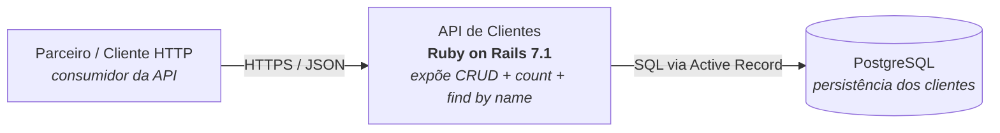
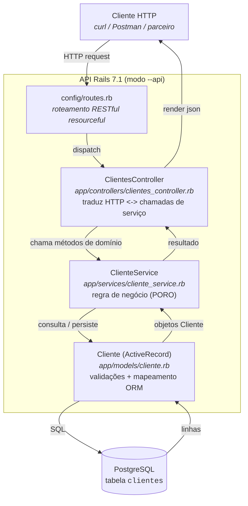
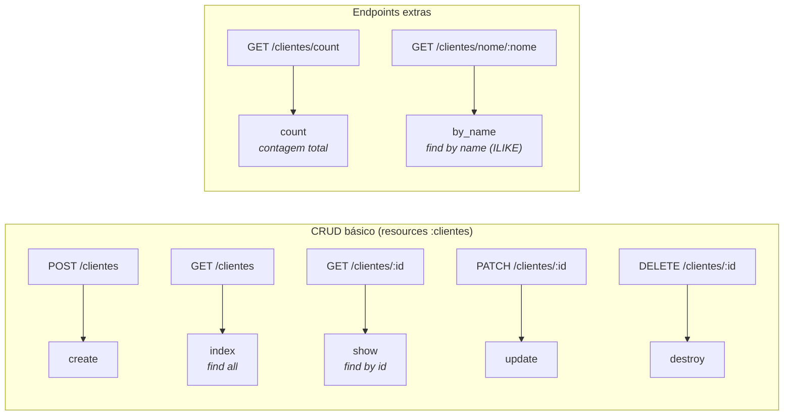
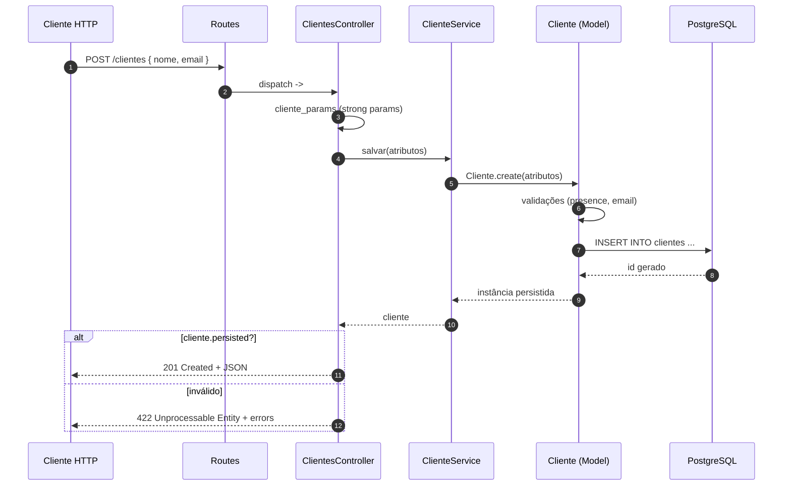

# Diagrama de Arquitetura — API de Clientes

Diagramas em **Mermaid** (renderizáveis nativamente em GitHub/GitLab e
exportáveis para PNG/SVG). A fonte de cada diagrama está no bloco de código
imediatamente abaixo do seu título.

---

## 1. Visão de Contexto (C4 — Nível 1)

Quem usa o sistema e com o que ele conversa.

---

## 2. Visão de Componentes (C4 — Nível 3) — padrão MVC

Como o request HTTP atravessa as camadas internas até chegar ao banco.

---

## 3. Mapa de Endpoints

Todos os endpoints expostos e a ação do controller que os atende.

---

## 4. Sequência — exemplo: `POST /clientes`

Fluxo de criação de um cliente, da chamada do parceiro até a resposta JSON.

