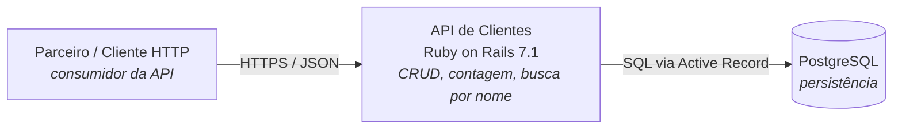
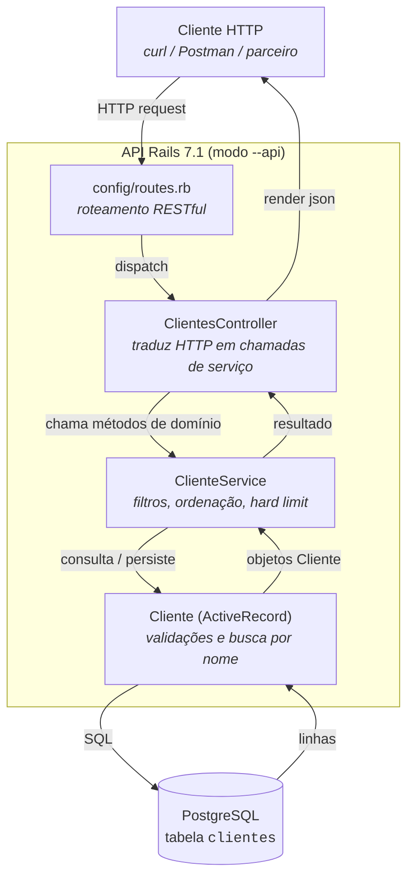
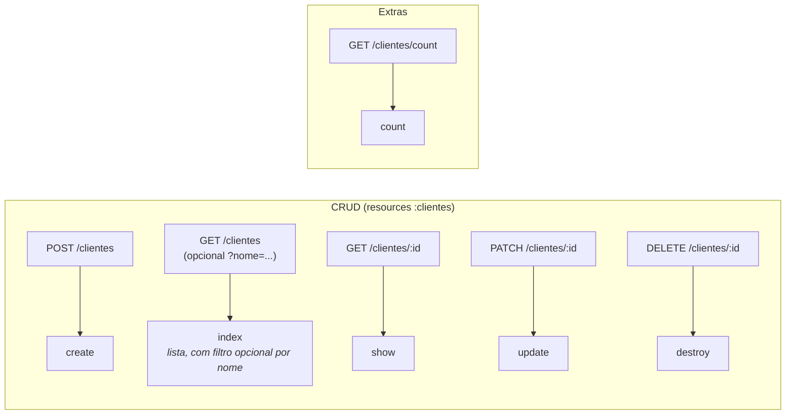
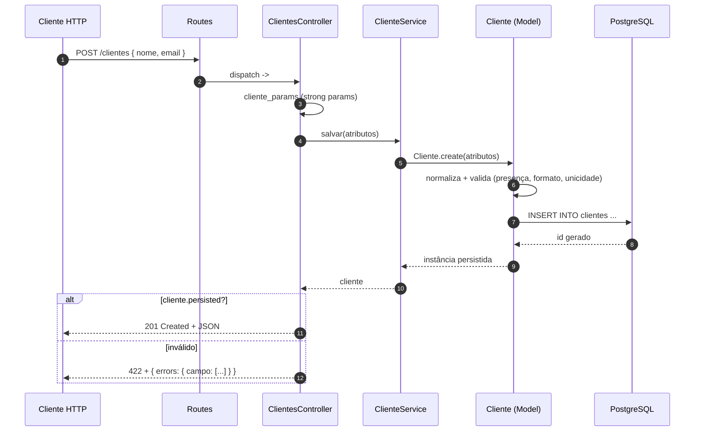

# Diagramas

Quatro diagramas em Mermaid. Renderizam direto no GitHub/GitLab e
podem ser exportados pra PNG/SVG se precisar.

## 1. Contexto (C4 nível 1)

## 2. Componentes (C4 nível 3)

## 3. Mapa de endpoints

## 4. Sequência de `POST /clientes`

